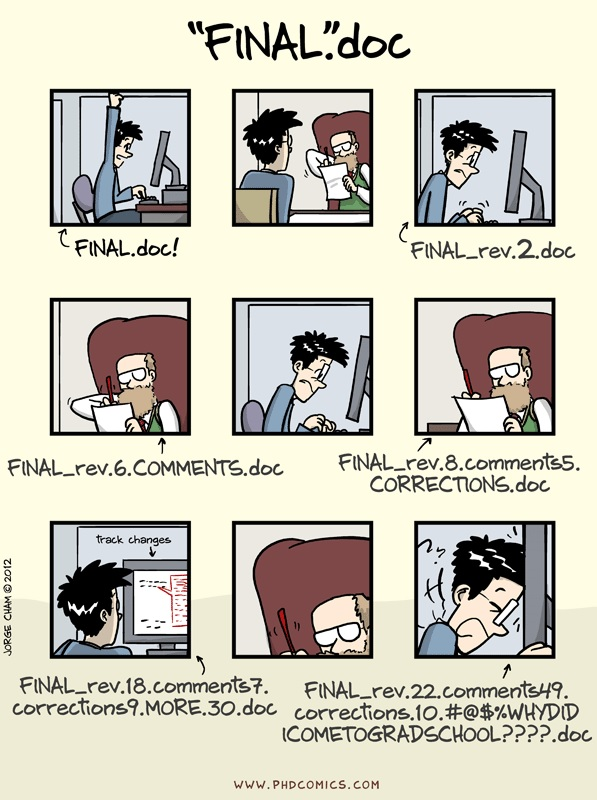

### 1.0 What is Version Control?

Version control shares many similarities with other softwares that you use everyday. Google, Word, even your operating system, operates a form of version control that maintains different version of the same file. Version control is a component of software configuration management and is defined as the management of changes to documents, datasets, scripts, or other files. Put more simply, version control is a way of maintaning and managing different versions of a file you are working on. 

Why you want version control? Well there are many reasons, but here are a few that make it important and worth the effort.

+ Keeps files that you lost (accidentally deleted, hard drive crashed, etc)
+ Allows you to revert changes that caused damage or problems (the ultimate ctrl/cmd+z)
+ Increases the ability to collaborate by making it easier
+ Keeps a history of actions to trace your previous work
+ Allows the monitoring of actions to prevent "illegal" data manipulation
+ Provides a widely accessible copy of your work

*But really...* After the first point does it really matter any of the others? I know what some of you might be thinking. With an infallible resource such as Recycling Bin, why would I ever need something like version control? Or some of you more advanced users might think, well I use a back-up drive. Or, what you really all are thinking is that "it won't happen to me". And I am here to say that it can and it will. As the quote-unquote computer person in my biology program, I have been called into save the day on many desperate people attempting to save lost information. The sad part is that these people often are unable to recover it all no matter what techniques they use. The one thing that all these individuals had in common was that the information they lost was never that much. It was rarely a catastrophic lost of an entire computer without backups. It was usually a few days work or work they collected a day in the field. Realistically if you started a grant in the morning and lost the file half way through the day, wouldn't you be upset? Isn't there an easier way?

With the sales pitch out of the way, Version control keeps a traceable record of your information through a series of steps. Github is a form of version control that, similar to Google drive, offers free data repositories online for you to send your files. The neat thing about Github is that its original design is for saving code, so it has embeded utilities that make it easier for R and Python users or anyone else who is coding. This allows for some added benefits that I can show you towards the end of our workshop. It can also be used for datasets, word documents, images, but I will not be covering those today.

