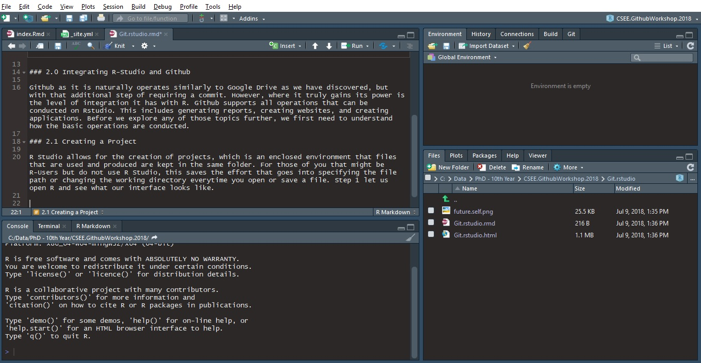
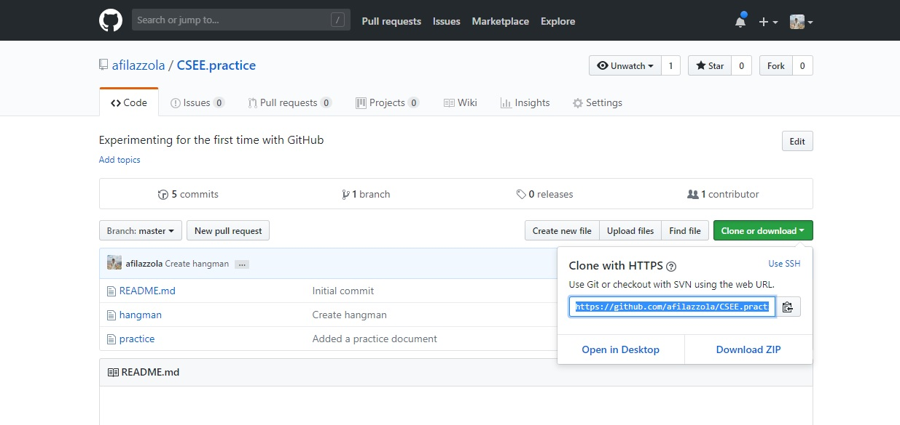
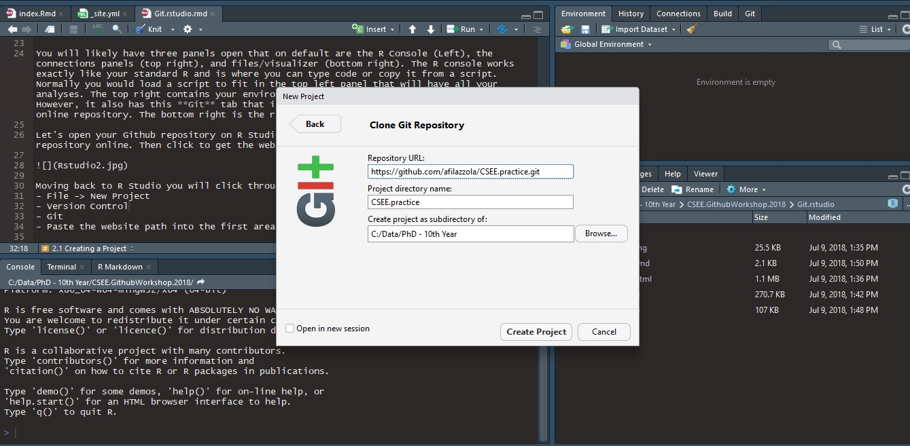
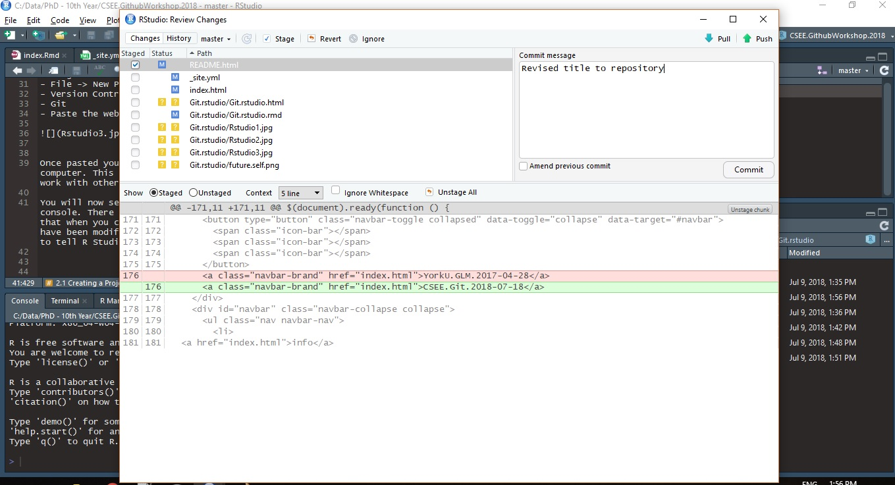

### 2.0 Integrating R-Studio and Github

Github as it is naturally operates similarly to Google Drive as we have discovered, but with that additional step of requiring a commit. However, where it truly gains its power is the level of integration it has with R. Github supports all operations that can be conducted on Rstudio. This includes generating reports, creating websites, and creating applications. Before we explore any of those topics further, we first need to understand how the basic operations are conducted. 

### 2.1 Creating a Project

R Studio allows for the creation of projects, which is an enclosed environment that files that are used and produced are kept in the same folder. For those of you that might be R-Users but do not use R Studio, this saves the effort that goes into specifying the file path or changing the working directory everytime you open or save a file. Step 1 let us open R and see what our interface looks like. 

You will likely have three panels open that on default are the R Console (Left), the connections panels (top right), and files/visualizer (bottom right). The R console works exactly like your standard R and is where you can type code or copy it from a script. Normally you would load a script to fit in the top left panel that will have all your analyses. The top right contains your environment with all your operations or datasets. However, it also has this **Git** tab that is how your Rstudio communications with your online repository. The bottom right is the repository file path. 

Let's open your Github repository on R Studio. First you need to go back to your Github repository online. Then click to get the website path using the clone repository button. 

Moving back to R Studio you will click through the following opens:
- File -> New Project
- Version Control
- Git
- Paste the website path into Repository URL

Once pasted you will have now copied all files from your online repository onto your computer. This will include the hangman file if you were Person A. This cloning would also work with other people's repository and is not limited to just yours. 

You will now see a newly generated tab in the communications panel in the top right of your console. There are a few items here that important and useful. First is the commit button that when you click on it will bring up another panel. This panel identifies files that have been modified and gives you the opportunity to stage them. The staging step is a way to tell R Studio that you are selecting these files to be commited. You should currently have it empty since you just downloaded the repository, everything should be up-to date. 

### 2.2 Pushing files to Github

Let's change that. Open your hangman file if you're **Person A**. If you are **Person B** or a third wheeler, create your open hangman file by going to File --> New File --> R Script and save it. Once the file is open, modify it or write something in it and then save. You should now see that file populate in the panel under Git. We are now going to commit it. 

The way to communicate between R Studio and Github has an additional step than the way we did it online. First, once a file has been modified, it will show in the communications panel with an "M". Click on it and then click commmit. This will bring up a separate panel like the one shown below. 

Here the page is broken into three main components. The top left shows a list of files that were modified. The associated letters mean the following:
- "A" is that a file has been added
- "M" is that the file has been modified (probably the one you will see most often)
- "D" is that the file has been deleted
- "?" is that a file has been added or modified, but is an format that is not recognizable to determine what the modification was. For example, a text file shows up as M when you change the text because Github understands replacing or adding some text with other text. However, its harder for Github to determine a change to a picture because of the complexity behind the file format. Instead only question mark appears to signal something has changed in regards to this file. 

The next step here is to click on the file you want to commit and click `stage`. This is the same thing as selecting a file in most other file managers. On the bottom panel, Git will try and identify what changes were made to the file. Here it is showing I have replaced line 176 with new text. In the top right panel we right the commit message just like we did online. Then we click `Commit`. 

So far, this is essentially the same thing we did online. The additional step here is the `Push` and `Pull`. Pushing essentialy sends all your committed changes to the repository and pulling brings any changes from your repository to your computer. It is the equivalent of a one-directional sync method and it is what makes your computer communicate online. Normally, before you start any project you want to pull to make sure the repo you are using is currently up to date. We know ours is currently update because we just cloned it a few minutes ago. That means we can push this recently modified file and have it populate online. If our repo was not to date, you will have a warning to pull first before you push. 
Congratulations, you have successfully synced your R Studio with Github!

  