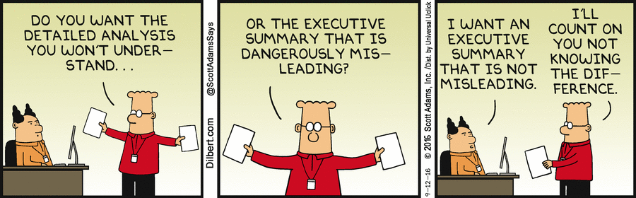

### 3.0 Writing active reports in R Studio

R Studio is a surprisingly flexible interface that allows for the creation of documents that can assist in communicating your findings. I have adopted this approach of creating a GitHub repository and active report file in almost all of the projects I have been recently involved in. This allows for all collaborators on the projec to stay up to date on the analysis, workflow, and data work. It also provides a consolidate area where all the files that are associated with a project can be maintained. The report document works ancillary to supporting this data similar to meta-data file explaining the information present in the repository. Ideally, when you get better at generating these files it is possible to keep them dynamic and constantly updating.

For example, lets say you have an experiment that surveys many times throughout its duration and has a particular analysis you expect. As the project continues along, certain individuals may expect updates that require you to conduct analysis and create figures. Having these dynamic reports though can make it as easy as dropping the newly surveyed dataset into the repository and clicking `knit` to revise the report. 

